# Chronologie : périodes et événements

> VUE GÉNÉRÉE — ne pas modifier ce fichier. Source : [STORY_SOURCE.md](../STORY_SOURCE.md).
> Empreinte SHA-256 : `ba944c7a74e945856f5afd53d6ffbf036331574db7b128b5b9383f7a00d388f2`.

Le schéma représente l’ordre causal des événements sélectionnés, pas une échelle de durée. A-source appartient à l’histoire réalisée ; A-fenêtre s’ouvre en Z. Les dates approximatives demeurent proposées.

```mermaid
flowchart TD
  E0["Avant le Grand Bâillon : La crise de l’héritage"]
  E1["Avant le vote et le Grand Bâillon : L’envoi des capsules"]
  E2["Après le départ des capsules : Le vote, le coup d’État et le Grand Bâillon"]
  E3["Du Bâillon au réveil sur Sélis : L’occupation et la recherche"]
  E4["A − 7 ans : Le réveil d’Elio"]
  E5["A − 4 ans : La rencontre professionnelle"]
  E6["A − 2 ans : Le couple"]
  E7["A-source : L’expérience originale"]
  E8["Après A-source, puis G : La révélation, la réconciliation et Orthe"]
  E9["Après l’arrivée sur Orthe, avant la tournée : Le premier essai insuffisant"]
  E10["Après le premier essai : La tournée des six régions"]
  E11["Deuxième essai, avant la collaboration : La perte de l’histoire-source"]
  E12["Après la mort de Lyra-source : Le marchandage et la collaboration"]
  E13["Après la collaboration, jusqu’à Z : La rupture et l’essai préparé vers A"]
  E14["Z = A + 14 ans, repère de travail : L’assaut contre le scientifique"]
  E15["En Z, à l’intérieur de A-fenêtre : Le prologue joué"]
  E16["Z, début du parcours joué : L’arrivée chez ceux qui le connaissent"]
  E17["Pendant les six arcs régionaux : La reprise de l’ancre"]
  E18["Convergence au présent d’Orthe : Le Cœur et la chute de la tutelle"]
  E19["Après la stabilisation d’Orthe : La dernière ouverture"]
  E20["Après la dernière ouverture : Les routes ouvertes"]
  E0 --> E1
  E1 --> E2
  E2 --> E3
  E3 --> E4
  E4 --> E5
  E5 --> E6
  E6 --> E7
  E7 --> E8
  E8 --> E9
  E9 --> E10
  E10 --> E11
  E11 --> E12
  E12 --> E13
  E13 --> E14
  E14 --> E15
  E15 --> E16
  E16 --> E17
  E17 --> E18
  E18 --> E19
  E19 --> E20
```

| Période | Événement | Ce qui se passe | Statut / source |
| --- | --- | --- | --- |
| Temps primordial | Le berceau du cosmos | Le berceau des fondateurs devient Orthe. Ses peuples et son histoire matérielle précèdent la venue du protagoniste. La formulation cosmologique fine reste à développer. | PROPOSE · [EVT-001](../STORY_SOURCE.md#evt-001) |
| Ères de fondation | Les migrations humaines | Les humains ordinaires peuplent d’autres planètes tandis que les Porteurs demeurent sur Orthe. Des communautés humaines importantes restent également sur le monde fondateur. | CONFIRME · [EVT-002](../STORY_SOURCE.md#evt-002) |
| Avant le Grand Bâillon | La crise de l’héritage | Des abus réels de pouvoirs nourrissent les mouvements de régulation. Séveran commence comme réformateur, puis son projet se radicalise tandis que sa faction développe clandestinement implants et régulateurs. Les tensions politiques croissent ; les noms des institutions et les dates exactes restent à définir. | CONFIRME · [EVT-003](../STORY_SOURCE.md#evt-003) |
| Avant le vote et le Grand Bâillon | L’envoi des capsules | Environ cent Porteurs volontaires sont placés en stase et envoyés vers différentes planètes pendant les tensions politiques. Leurs capsules ont déjà quitté Orthe et sa zone d’influence lorsque survient le Bâillon ; leur préservation ne dépend d’aucune exemption de registre. Le nombre exact, l’autorité fondatrice et les destinations restent à préciser. Elio maîtrise déjà Spatial lorsqu’il entre en stase, même si celle-ci lui fera perdre cet apprentissage conscient. | CONFIRME · [EVT-004](../STORY_SOURCE.md#evt-004) |
| Après le départ des capsules | Le vote, le coup d’État et le Grand Bâillon | La tendance du vote favorise le maintien d’un Cœur libre. La faction radicale de Séveran refuse cette issue, tente de prendre le Cœur et déclenche une guerre civile autour de ses installations. L’interférence du dispositif expérimental et les dégâts de la bataille provoquent accidentellement le Grand Bâillon dans la zone d’influence d’Orthe. Les prototypes clandestins donnent ensuite à la faction un avantage militaire décisif malgré leurs effets corrupteurs ; elle consolide le Concordat au nom de l’ordre. | CONFIRME · [EVT-005](../STORY_SOURCE.md#evt-005) |
| Du Bâillon au réveil sur Sélis | L’occupation et la recherche | Orthe connaît des phases de paix contrainte, de révolte et de recomposition ; ce n’est pas une guerre de front identique pendant six millénaires. Le Concordat perfectionne les réveils forcés issus des prototypes antérieurs. Un collectif Biotique participe aux soins même lorsque les noyaux sont affaiblis. Lyra se porte volontaire pour rechercher les capsules grâce à des vaisseaux, relais et technologies, sans parvenir à établir le sort de la plupart d’entre elles. | PROPOSE · [EVT-006](../STORY_SOURCE.md#evt-006) |
| A − 7 ans | Le réveil d’Elio | Lyra retrouve sur Sélis la seule capsule dont un survivant sera confirmé pendant l’arc principal. Elio sort de stase avec une mémoire autobiographique presque entièrement perdue, mais conserve ses connaissances générales et des intuitions spatiales implicites. Après les premiers secours et une observation distante, Lyra est rappelée sur Orthe parce que les affrontements politiques ont fait de nombreux blessés et que son collectif Biotique manque de personnel. Ce rappel n’est pas une punition. | PROPOSE · [EVT-007](../STORY_SOURCE.md#evt-007) |
| A − 4 ans | La rencontre professionnelle | De retour sur Sélis, Lyra se fait embaucher sous couverture dans l’environnement de travail d’Elio avec une mission d’approche et de compréhension. Elle possède les compétences nécessaires. Ils se rencontrent alors personnellement comme adultes, travaillent ensemble et deviennent amis. Les repères chiffrés exacts restent proposés. | PROPOSE · [EVT-008](../STORY_SOURCE.md#evt-008) |
| A − 2 ans | Le couple | La relation devient réellement amoureuse sans que Lyra ait nécessairement désobéi à sa mission. Elle n’a toujours révélé ni son origine d’Orthe, ni sa nature Biotique, ni la découverte de la capsule, ni le but initial de sa présence. Ces moments peuvent nourrir les flashbacks. | PROPOSE · [EVT-009](../STORY_SOURCE.md#evt-009) |
| A-source | L’expérience originale | Elio et Lyra testent dans le laboratoire de Sélis une technologie primitive de localisation spatio-temporelle extrêmement précise. Il n’y a pas d’attaque dans l’histoire-source. L’expérience enregistre une empreinte du lieu et de son état qui ne deviendra une ancre temporelle exploitable que bien plus tard. À cet instant, Elio aime Lyra mais ignore encore entièrement son origine d’Orthe, sa nature Biotique, la capsule et sa mission. | CONFIRME · [EVT-010](../STORY_SOURCE.md#evt-010) |
| Après A-source, puis G | La révélation, la réconciliation et Orthe | Après A-source, Lyra révèle son origine, sa nature, la recherche de la capsule et sa mission. Elio se sent trompé et le couple cesse temporairement de se parler, puis se réconcilie. La durée et les scènes exactes restent à écrire. Après cette réconciliation, Lyra propose ou accepte de l’emmener sur Orthe au point G. Les habitants reconnaissent son noyau intact et travaillent avec lui. Ses premiers travaux restent clandestins : des communautés l’apprécient sans que le Concordat ait encore identifié personnellement la source pure. | PROPOSE · [EVT-011](../STORY_SOURCE.md#evt-011) |
| Après l’arrivée sur Orthe, avant la tournée | Le premier essai insuffisant | Elio-source tente une première restauration du Cœur après son arrivée sur Orthe. Il échoue parce qu’il ne peut pas fournir et distribuer assez de puissance simultanément. Il comprend qu’il faut davantage de Porteurs actifs, de relais, de capacités distribuées et de synchronisation ; cet échec provoque la tournée des six régions. | CONFIRME · [EVT-023](../STORY_SOURCE.md#evt-023) |
| Après le premier essai | La tournée des six régions | Le couple aide les six régions, Elio réactive des Porteurs et détache progressivement un pétale dans chacune d’elles, soit six pétales seulement. Il développe Nacre avec des ingénieurs d’Orthe, mais ne lui intègre encore aucun fragment. Les pétales régionaux, les relais et les alliés préparent une deuxième tentative ; l’ordre interne des régions et les moyens de discrétion restent à développer. | CONFIRME · [EVT-012](../STORY_SOURCE.md#evt-012) |
| Deuxième essai, avant la collaboration | La perte de l’histoire-source | Après la tournée, Elio et ses alliés tentent une restauration plus importante du Cœur. L’opération attire l’attention de Séveran, qui découvre l’existence d’Elio, son centre pur et son potentiel pour la tutelle. Il attaque ; Lyra-source s’interpose et meurt des blessures de l’affrontement, non de la destruction de son noyau. | CONFIRME · [EVT-014](../STORY_SOURCE.md#evt-014) |
| Après la mort de Lyra-source | Le marchandage et la collaboration | Après la mort de Lyra, Elio veut tuer Séveran mais n’en a pas la puissance. Sa sécurité anti-confiscation empêche une prise immédiate du noyau. Séveran lui propose de combiner leurs technologies pour lui permettre de revoir Lyra ; Elio endeuillé accepte cette coopération. Ses modalités, sa durée et le travail précis accompli restent proposés. | CONFIRME · [EVT-013](../STORY_SOURCE.md#evt-013) |
| Après la collaboration, jusqu’à Z | La rupture et l’essai préparé vers A | Elio quitte Séveran et retourne secrètement sur Sélis. Il poursuit ses recherches pour revoir Lyra, comprend que l’empreinte primitive de A permet d’en retrouver l’instant et prépare une ouverture vers cette période de leur vie. Nacre participe aux essais ; elle existe encore sans le septième pétale. Le motif précis de la rupture reste une liaison proposée. | PROPOSE · [EVT-015](../STORY_SOURCE.md#evt-015) |
| Z = A + 14 ans, repère de travail | L’assaut contre le scientifique | Pressentant un danger, Elio détache à Z son septième pétale, l’intègre à Nacre et arme la routine « évacue-moi vers Orthe ». Séveran arrive avant l’évacuation. Elio rend son centre inutilisable, puis l’antagoniste le tue par violence physique. La routine reste active avec une cible morte ; Séveran ouvre ensuite le prototype déjà réglé sur A pour tenter de capturer le noyau jeune. | PROPOSE · [EVT-016](../STORY_SOURCE.md#evt-016) |
| En Z, à l’intérieur de A-fenêtre | Le prologue joué | Séveran entre dans A-fenêtre. La routine active de Nacre détecte de l’autre côté une version vivante compatible d’Elio et adapte sa cible ; elle suit la faille. Lyra s’interpose, Elio la croit morte et Nacre l’extrait pendant la diversion. Séveran constate la disparition de sa cible et ressort sans voir l’extraction. La fenêtre n’est suspendue qu’après son retour ; Lyra demeure à l’intérieur, gravement blessée mais pas définitivement morte. | PROPOSE · [EVT-017](../STORY_SOURCE.md#evt-017) |
| Z, début du parcours joué | L’arrivée chez ceux qui le connaissent | Nacre et Elio repassent par le laboratoire au présent Z, puis la routine termine son ordre initial en les conduisant au Havre d’Orthe par un relais spatial. Les habitants ont connu le scientifique et Lyra-source. Elio n’a pas vécu ces années et ignorait jusqu’à l’existence d’Orthe ainsi que la véritable identité de Lyra ; leur familiarité est donc profondément perturbante. La mort du scientifique n’est pas encore publiquement établie. Séveran ignore où sa cible a disparu et ses forces ne disposent d’abord d’aucune piste personnelle certaine. | PROPOSE · [EVT-018](../STORY_SOURCE.md#evt-018) |
| Pendant les six arcs régionaux | La reprise de l’ancre | L’équipe traite les conflits propres aux six régions, négocie le retrait risqué de chaque pétale et prépare des relais de transition sans supprimer tout coût. Le héros apprend d’abord Énergie, retrouve progressivement Gravité grâce aux fragments, puis Spatial après la révélation de son passé ancien. Il apprend aussi Mecha dans son berceau historique, les Chantiers de Cendre ; le chapitre exact de cette étape reste à développer. | PROPOSE · [EVT-019](../STORY_SOURCE.md#evt-019) |
| Convergence au présent d’Orthe | Le Cœur et la chute de la tutelle | Les six pétales régionaux, Nacre portant depuis Z le septième encore inaccessible, Elio et les alliés convergent pour redémarrer et stabiliser le Cœur. La coalition affronte le projet de tutelle de Séveran au présent d’Orthe et le défait sans modifier aucun événement antérieur. La microchronologie et la connexion scientifique exacte des pétales restent en partie ouvertes. | PROPOSE · [EVT-021](../STORY_SOURCE.md#evt-021) |
| Après la stabilisation d’Orthe | La dernière ouverture | Avec l’ancre originale, un appareil compatible et une équipe médicale, Elio reprend le même reliquat après la victoire collective. Il est trop tard pour éviter le coup ; une continuité viable permet l’extraction de Lyra. Les soins se poursuivent dans le présent, puis Lyra commence ultérieurement à transmettre Biotique au protagoniste. | PROPOSE · [EVT-020](../STORY_SOURCE.md#evt-020) |
| Après la dernière ouverture | Les routes ouvertes | Très tard, la lecture du pétale placé dans Nacre à Z fournit les derniers souvenirs directs d’Elio-source jusqu’à son détachement. Les données propres de Nacre complètent ensuite l’assassinat et le secours sans faire d’elle une copie du scientifique. L’accès temporel dangereux et le corps ou composant qui le porte sont détruits. Après un transfert préparé et risqué, Nacre revient comme assistant sans pouvoir temporel. Le couple se retrouve sans effacer les épreuves ; les survivants réorganisent Orthe et renouent les routes vers les autres planètes, notamment pour rechercher les capsules dont le sort reste inconnu. | PROPOSE · [EVT-022](../STORY_SOURCE.md#evt-022) |

## Lecture textuelle des mêmes repères

Avant le Grand Bâillon — La crise de l’héritage

↓

Avant le vote et le Grand Bâillon — L’envoi des capsules

↓

Après le départ des capsules — Le vote, le coup d’État et le Grand Bâillon

↓

Du Bâillon au réveil sur Sélis — L’occupation et la recherche

↓

A − 7 ans — Le réveil d’Elio

↓

A − 4 ans — La rencontre professionnelle

↓

A − 2 ans — Le couple

↓

A-source — L’expérience originale

↓

Après A-source, puis G — La révélation, la réconciliation et Orthe

↓

Après l’arrivée sur Orthe, avant la tournée — Le premier essai insuffisant

↓

Après le premier essai — La tournée des six régions

↓

Deuxième essai, avant la collaboration — La perte de l’histoire-source

↓

Après la mort de Lyra-source — Le marchandage et la collaboration

↓

Après la collaboration, jusqu’à Z — La rupture et l’essai préparé vers A

↓

Z = A + 14 ans, repère de travail — L’assaut contre le scientifique

↓

En Z, à l’intérieur de A-fenêtre — Le prologue joué

↓

Z, début du parcours joué — L’arrivée chez ceux qui le connaissent

↓

Pendant les six arcs régionaux — La reprise de l’ancre

↓

Convergence au présent d’Orthe — Le Cœur et la chute de la tutelle

↓

Après la stabilisation d’Orthe — La dernière ouverture

↓

Après la dernière ouverture — Les routes ouvertes
