# Chronologie : périodes et événements

> VUE GÉNÉRÉE — ne pas modifier ce fichier. Source : [STORY_SOURCE.md](../STORY_SOURCE.md).
> Empreinte SHA-256 : `5f5a53cf41cc7ef7fde4e97e5e4f85720edf9c2c3d38d683d574ee066453ee02`.

Le schéma représente l’ordre causal des événements sélectionnés, pas une échelle de durée. A-source appartient à l’histoire réalisée ; A-fenêtre s’ouvre en Z. Les dates approximatives demeurent proposées.

```mermaid
flowchart TD
  E0["Environ A − 6 040 à A − 6 000 ans : La guerre de la Tutelle"]
  E1["Environ A − 6 000 ans : Le Grand Bâillon"]
  E2["Autour du Grand Bâillon, dispersion après le sabotage : L’envoi des capsules"]
  E3["Du Bâillon au réveil sur Sélis : L’occupation et la recherche"]
  E4["A − 7 ans : Le réveil d’Elio"]
  E5["A − 4 ans : La rencontre professionnelle"]
  E6["A − 2 ans : Le couple"]
  E7["A-source : L’expérience originale"]
  E8["G = A + 4 ans : La découverte d’Orthe"]
  E9["Après l’arrivée sur Orthe, avant la tournée : Le premier essai insuffisant"]
  E10["Après le premier essai : La tournée des six régions"]
  E11["Deuxième essai, avant la collaboration : La perte de l’histoire-source"]
  E12["Après la mort de Lyra-source : Le marchandage et la collaboration"]
  E13["Après la collaboration, jusqu’à Z : La rupture et l’essai préparé vers A"]
  E14["Z = A + 14 ans, repère de travail : L’assaut contre le scientifique"]
  E15["En Z, à l’intérieur de A-fenêtre : Le prologue joué"]
  E16["Z, début du parcours joué : L’arrivée chez ceux qui le connaissent"]
  E17["Pendant les six arcs régionaux : La reprise de l’ancre"]
  E18["Convergence au présent d’Orthe : Le Cœur et la chute de la tutelle"]
  E19["Après la stabilisation d’Orthe : La dernière ouverture"]
  E20["Après la dernière ouverture : Les routes ouvertes"]
  E0 --> E1
  E1 --> E2
  E2 --> E3
  E3 --> E4
  E4 --> E5
  E5 --> E6
  E6 --> E7
  E7 --> E8
  E8 --> E9
  E9 --> E10
  E10 --> E11
  E11 --> E12
  E12 --> E13
  E13 --> E14
  E14 --> E15
  E15 --> E16
  E16 --> E17
  E17 --> E18
  E18 --> E19
  E19 --> E20
```

| Période | Événement | Ce qui se passe | Statut / source |
| --- | --- | --- | --- |
| Temps primordial | Le berceau du cosmos | Le berceau des fondateurs devient Orthe. Ses peuples et son histoire matérielle précèdent la venue du protagoniste. La formulation cosmologique fine reste à développer. | PROPOSE · [EVT-001](../STORY_SOURCE.md#evt-001) |
| Ères de fondation | Les migrations humaines | Les humains ordinaires peuplent d’autres planètes tandis que les Porteurs demeurent sur Orthe. Des communautés humaines importantes restent également sur le monde fondateur. | CONFIRME · [EVT-002](../STORY_SOURCE.md#evt-002) |
| Environ A − 6 040 à A − 6 000 ans | La guerre de la Tutelle | Des catastrophes liées aux pouvoirs et des conflits de représentation débouchent sur une guerre. La Ligue de Séveran prépare le contrôle central des infrastructures ; les oppositions locales restent diverses. | PROPOSE · [EVT-003](../STORY_SOURCE.md#evt-003) |
| Environ A − 6 000 ans | Le Grand Bâillon | Séveran provoque l’inhibition générale, perd ses propres capacités actives et tire parti de ses préparatifs matériels. Sa faction consolide le Concordat au nom de la paix. La réparation des noyaux devient ensuite un enjeu central des deux camps. | PROPOSE · [EVT-005](../STORY_SOURCE.md#evt-005) |
| Autour du Grand Bâillon, dispersion après le sabotage | L’envoi des capsules | Environ cent Porteurs volontaires sont isolés du réseau avant le sabotage, puis leurs capsules sont envoyées et dispersées après le Grand Bâillon. Le nombre exact et les destinations restent à préciser. Elio maîtrise déjà Spatial lorsqu’il entre en stase, même si celle-ci lui fera oublier consciemment cet apprentissage. | CONFIRME · [EVT-004](../STORY_SOURCE.md#evt-004) |
| Du Bâillon au réveil sur Sélis | L’occupation et la recherche | Orthe connaît des phases de paix contrainte, de révolte et de recomposition ; ce n’est pas une guerre de front identique pendant six millénaires. Les missions de recherche poursuivent les capsules sans parvenir à établir le sort de la plupart d’entre elles. Lyra utilise des moyens de voyage physiques ou des relais, pas des pouvoirs intacts. Le Concordat développe lentement ses réveils forcés. | PROPOSE · [EVT-006](../STORY_SOURCE.md#evt-006) |
| A − 7 ans | Le réveil d’Elio | Lyra retrouve sur Sélis la seule capsule dont un survivant sera confirmé pendant l’arc principal. Elio sort de stase, conserve un âge biologique de jeune adulte, a oublié sa maîtrise consciente de Spatial et doit se construire une vie. Après les premiers secours et une observation distante, Lyra est rappelée sur Orthe. | PROPOSE · [EVT-007](../STORY_SOURCE.md#evt-007) |
| A − 4 ans | La rencontre professionnelle | De retour sur Sélis, Lyra retrouve Elio grâce à sa vie professionnelle et se fait embaucher sous couverture. Ils se rencontrent alors personnellement, travaillent ensemble et deviennent amis. Elio a vécu trois années hors stase depuis son réveil. | PROPOSE · [EVT-008](../STORY_SOURCE.md#evt-008) |
| A − 2 ans | Le couple | La relation devient amoureuse. La proposition conserve une rupture de Lyra avec sa mission intrusive avant cet engagement, sans effacer le secret sur son origine. Ces moments peuvent nourrir les flashbacks. | PROPOSE · [EVT-009](../STORY_SOURCE.md#evt-009) |
| A-source | L’expérience originale | Elio et Lyra testent l’anneau témoin dans le laboratoire de Sélis. Il n’y a pas d’attaque dans l’histoire-source. L’expérience conserve la seule ancre complète qui deviendra exploitable. Elio a alors 29 années vécues hors stase ; son corps ne vieillit plus normalement après sa maturité. | PROPOSE · [EVT-010](../STORY_SOURCE.md#evt-010) |
| G = A + 4 ans | La découverte d’Orthe | Le scientifique de l’histoire-source découvre comment atteindre Orthe ; Lyra lui a révélé son origine avant leur arrivée. Les habitants reconnaissent son noyau intact et travaillent avec lui. Ses premiers travaux restent clandestins : des communautés l’apprécient sans que le Concordat ait encore identifié personnellement la source pure. | PROPOSE · [EVT-011](../STORY_SOURCE.md#evt-011) |
| Après l’arrivée sur Orthe, avant la tournée | Le premier essai insuffisant | Elio-source tente une première restauration du Cœur après son arrivée sur Orthe. Il échoue parce qu’il ne peut pas fournir et distribuer assez de puissance simultanément. Il comprend qu’il faut davantage de Porteurs actifs, de relais, de capacités distribuées et de synchronisation ; cet échec provoque la tournée des six régions. | CONFIRME · [EVT-023](../STORY_SOURCE.md#evt-023) |
| Après le premier essai | La tournée des six régions | Le couple aide les six régions, Elio réactive des Porteurs et détache progressivement un pétale dans chacune d’elles. Il développe Nacre avec des ingénieurs d’Orthe et lui intègre le septième pétale. Les fragments, les relais et les alliés préparent une deuxième tentative ; l’ordre interne des régions et les moyens de discrétion restent à développer. | CONFIRME · [EVT-012](../STORY_SOURCE.md#evt-012) |
| Deuxième essai, avant la collaboration | La perte de l’histoire-source | Après la tournée, Elio et ses alliés tentent une restauration plus importante du Cœur. L’opération attire l’attention de Séveran, qui découvre l’existence d’Elio, son centre pur et son potentiel pour la tutelle. Il attaque ; Lyra-source s’interpose et meurt des blessures de l’affrontement, non de la destruction de son noyau. | CONFIRME · [EVT-014](../STORY_SOURCE.md#evt-014) |
| Après la mort de Lyra-source | Le marchandage et la collaboration | Après la mort de Lyra, Elio veut tuer Séveran mais n’en a pas la puissance. Sa sécurité anti-confiscation empêche une prise immédiate du noyau. Séveran lui propose de combiner leurs technologies pour lui permettre de revoir Lyra ; Elio endeuillé accepte cette coopération. Ses modalités, sa durée et le travail précis accompli restent proposés. | CONFIRME · [EVT-013](../STORY_SOURCE.md#evt-013) |
| Après la collaboration, jusqu’à Z | La rupture et l’essai préparé vers A | Elio quitte Séveran et retourne secrètement sur Sélis. Il poursuit ses recherches pour revoir Lyra, corrige certaines erreurs et prépare une ouverture vers A, moment de leur vie commune choisi à l’avance. Nacre participe aux essais et possède une routine de secours. Le motif précis de la rupture reste une liaison proposée. | PROPOSE · [EVT-015](../STORY_SOURCE.md#evt-015) |
| Z = A + 14 ans, repère de travail | L’assaut contre le scientifique | Séveran retrouve Elio au laboratoire de Z. Elio désactive volontairement son centre, puis Séveran le tue par violence physique. Nacre reçoit la dernière consigne ; l’assaillant utilise ensuite le prototype déjà réglé sur A pour tenter de capturer le noyau jeune. | PROPOSE · [EVT-016](../STORY_SOURCE.md#evt-016) |
| En Z, à l’intérieur de A-fenêtre | Le prologue joué | Séveran entre, Nacre le suit. Lyra s’interpose ; Elio la croit morte et Nacre l’extrait pendant la diversion. Séveran constate la disparition de sa cible et ressort. Il ne voit pas l’extraction et ne possède ensuite aucune preuve de mort, de survie ou de destination. La fenêtre n’est suspendue qu’après son retour ; Lyra demeure à l’intérieur, gravement blessée mais pas définitivement morte. | PROPOSE · [EVT-017](../STORY_SOURCE.md#evt-017) |
| Z, début du parcours joué | L’arrivée chez ceux qui le connaissent | Nacre et Elio repassent par le laboratoire au présent puis rejoignent le Havre d’Orthe par un relais spatial. Les habitants ont connu le scientifique de l’histoire-source. Elio n’a pas vécu ces années ; la mort du scientifique n’est pas encore publiquement établie. Séveran ignore où sa cible a disparu et ses forces ne disposent d’abord d’aucune piste personnelle certaine. | PROPOSE · [EVT-018](../STORY_SOURCE.md#evt-018) |
| Pendant les six arcs régionaux | La reprise de l’ancre | L’équipe traite les conflits propres aux six régions, négocie le retrait risqué de chaque pétale et prépare des relais de transition sans supprimer tout coût. Le héros apprend d’abord Énergie, retrouve progressivement Gravité grâce aux fragments, puis Spatial après la révélation de son passé ancien. Il apprend aussi Mecha auprès de la culture technologique concernée ; la région et les chapitres exacts de ces étapes restent à placer. | PROPOSE · [EVT-019](../STORY_SOURCE.md#evt-019) |
| Convergence au présent d’Orthe | Le Cœur et la chute de la tutelle | Les six pétales régionaux, Nacre avec le septième, Elio et les alliés convergent pour redémarrer et stabiliser le Cœur. La coalition affronte le projet de tutelle de Séveran au présent d’Orthe et le défait sans modifier aucun événement antérieur. La microchronologie et la connexion scientifique exacte des pétales restent en partie ouvertes. | PROPOSE · [EVT-021](../STORY_SOURCE.md#evt-021) |
| Après la stabilisation d’Orthe | La dernière ouverture | Avec l’ancre originale, un appareil compatible et une équipe médicale, Elio reprend le même reliquat après la victoire collective. Il est trop tard pour éviter le coup ; une continuité viable permet l’extraction de Lyra. Les soins se poursuivent dans le présent, puis Lyra commence ultérieurement à transmettre Biotique au protagoniste. | PROPOSE · [EVT-020](../STORY_SOURCE.md#evt-020) |
| Après la dernière ouverture | Les routes ouvertes | Très tard, la lecture du pétale de Nacre complète la mémoire d’Elio-source sans faire d’elle sa copie. L’accès temporel dangereux et le corps ou composant qui le porte sont ensuite détruits. Après un transfert préparé et risqué, Nacre revient comme assistant sans pouvoir temporel. Le couple se retrouve sans effacer les épreuves ; les survivants réorganisent Orthe et renouent les routes vers les autres planètes, notamment pour rechercher les capsules dont le sort reste inconnu. | PROPOSE · [EVT-022](../STORY_SOURCE.md#evt-022) |

## Lecture textuelle des mêmes repères

Environ A − 6 040 à A − 6 000 ans — La guerre de la Tutelle

↓

Environ A − 6 000 ans — Le Grand Bâillon

↓

Autour du Grand Bâillon, dispersion après le sabotage — L’envoi des capsules

↓

Du Bâillon au réveil sur Sélis — L’occupation et la recherche

↓

A − 7 ans — Le réveil d’Elio

↓

A − 4 ans — La rencontre professionnelle

↓

A − 2 ans — Le couple

↓

A-source — L’expérience originale

↓

G = A + 4 ans — La découverte d’Orthe

↓

Après l’arrivée sur Orthe, avant la tournée — Le premier essai insuffisant

↓

Après le premier essai — La tournée des six régions

↓

Deuxième essai, avant la collaboration — La perte de l’histoire-source

↓

Après la mort de Lyra-source — Le marchandage et la collaboration

↓

Après la collaboration, jusqu’à Z — La rupture et l’essai préparé vers A

↓

Z = A + 14 ans, repère de travail — L’assaut contre le scientifique

↓

En Z, à l’intérieur de A-fenêtre — Le prologue joué

↓

Z, début du parcours joué — L’arrivée chez ceux qui le connaissent

↓

Pendant les six arcs régionaux — La reprise de l’ancre

↓

Convergence au présent d’Orthe — Le Cœur et la chute de la tutelle

↓

Après la stabilisation d’Orthe — La dernière ouverture

↓

Après la dernière ouverture — Les routes ouvertes
