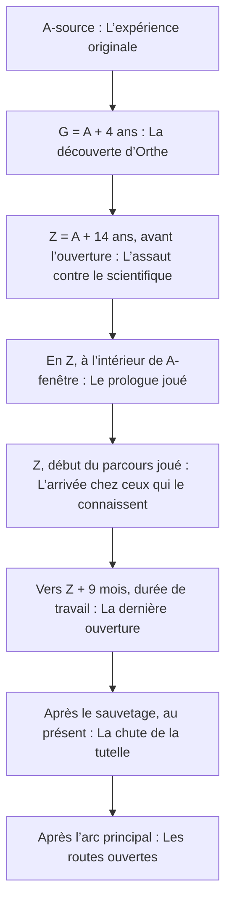

# Chronologie : périodes et événements

> VUE GÉNÉRÉE — ne pas modifier ce fichier. Source : [STORY_SOURCE.md](../STORY_SOURCE.md).
> Empreinte SHA-256 : `bfb838ad7d987313a569aaa72a225e0be28fa6c77d825a780f0c3e8815cff8ba`.

Le schéma représente l’ordre causal des événements sélectionnés, pas une échelle de durée. A-source appartient à l’histoire réalisée ; A-fenêtre s’ouvre en Z. Les dates approximatives demeurent proposées.

| Période | Événement | Ce qui se passe | Statut / source |
| --- | --- | --- | --- |
| Temps primordial | Le berceau du cosmos | Le berceau des fondateurs devient Orthe. Ses peuples et son histoire matérielle précèdent la venue du protagoniste. La formulation cosmologique fine reste à développer. | PROPOSE · [EVT-001](../STORY_SOURCE.md#evt-001) |
| Ères de fondation | Les migrations humaines | Les humains ordinaires peuplent d’autres planètes tandis que les Porteurs demeurent sur Orthe. Des communautés humaines importantes restent également sur le monde fondateur. | CONFIRME · [EVT-002](../STORY_SOURCE.md#evt-002) |
| Environ A − 6 040 à A − 6 000 ans | La guerre de la Tutelle | Des catastrophes liées aux pouvoirs et des conflits de représentation débouchent sur une guerre. La Ligue de Séveran prépare le contrôle central des infrastructures ; les oppositions locales restent diverses. | PROPOSE · [EVT-003](../STORY_SOURCE.md#evt-003) |
| Environ A − 6 002 ans | L’envoi des capsules | Des noyaux encore non enregistrés sont isolés et dispersés avant la fermeture générale. Dans la solution proposée, Elio est un jeune adulte de 22 ans lorsqu’il entre en stase. Il n’a pas encore reçu l’apprentissage complet des Porteurs. | PROPOSE · [EVT-004](../STORY_SOURCE.md#evt-004) |
| Environ A − 6 000 ans | Le Grand Bâillon | Séveran provoque l’inhibition générale, perd ses propres capacités actives et tire parti de ses préparatifs matériels. Sa faction consolide le Concordat au nom de la paix. La réparation des noyaux devient ensuite un enjeu central des deux camps. | PROPOSE · [EVT-005](../STORY_SOURCE.md#evt-005) |
| Du Bâillon au réveil sur Sélis | L’occupation et la recherche | Orthe connaît des phases de paix contrainte, de révolte et de recomposition ; ce n’est pas une guerre de front identique pendant six millénaires. Les missions de recherche poursuivent les capsules. Lyra utilise des moyens de voyage physiques ou des relais, pas des pouvoirs intacts. Le Concordat développe lentement ses réveils forcés. | PROPOSE · [EVT-006](../STORY_SOURCE.md#evt-006) |
| A − 7 ans | Le réveil d’Elio | Lyra retrouve l’unique capsule survivante sur Sélis. Elio sort de stase, conserve un âge biologique de jeune adulte et doit se construire une vie. Après les premiers secours et une observation distante, Lyra est rappelée sur Orthe. | PROPOSE · [EVT-007](../STORY_SOURCE.md#evt-007) |
| A − 4 ans | La rencontre professionnelle | De retour sur Sélis, Lyra retrouve Elio grâce à sa vie professionnelle et se fait embaucher sous couverture. Ils se rencontrent alors personnellement, travaillent ensemble et deviennent amis. Elio a vécu trois années hors stase depuis son réveil. | PROPOSE · [EVT-008](../STORY_SOURCE.md#evt-008) |
| A − 2 ans | Le couple | La relation devient amoureuse. La proposition conserve une rupture de Lyra avec sa mission intrusive avant cet engagement, sans effacer le secret sur son origine. Ces moments peuvent nourrir les flashbacks. | PROPOSE · [EVT-009](../STORY_SOURCE.md#evt-009) |
| A-source | L’expérience originale | Elio et Lyra testent l’anneau témoin dans le laboratoire de Sélis. Il n’y a pas d’attaque dans l’histoire-source. L’expérience conserve la seule ancre complète qui deviendra exploitable. Elio a alors 29 années vécues hors stase ; son corps ne vieillit plus normalement après sa maturité. | PROPOSE · [EVT-010](../STORY_SOURCE.md#evt-010) |
| G = A + 4 ans | La découverte d’Orthe | Le scientifique de l’histoire-source découvre comment atteindre Orthe ; Lyra lui a révélé son origine avant leur arrivée. Les habitants reconnaissent son noyau intact et travaillent avec lui. Il n’arrive pas chez un peuple qui sait déjà tout résoudre sans lui, ni chez un peuple qui ne sait rien. | PROPOSE · [EVT-011](../STORY_SOURCE.md#evt-011) |
| De G à A + 8 ans | L’allié des régions | Le couple aide plusieurs communautés, apprend leurs méthodes et construit des relais. Le scientifique conçoit Nacre avec des ingénieurs locaux. Des personnages du futur groupe lui doivent une aide réelle, d’autres se méfient déjà des solutions trop centralisées. | PROPOSE · [EVT-012](../STORY_SOURCE.md#evt-012) |
| De A + 8 à A + 10 ans | Les compromis | Séveran offre des ressources et obtient des infrastructures de plus en plus centralisées. Elio croit stabiliser des services civils, puis sous-estime leurs possibilités coercitives. Il ne remet pas volontairement son noyau à la Matrice. Lyra s’oppose à cette évolution. | PROPOSE · [EVT-013](../STORY_SOURCE.md#evt-013) |
| A + 10 ans | La perte de l’histoire-source | Lyra de l’histoire-source se sacrifie pendant l’évacuation d’une cité ; son noyau est détruit. Elio s’enfonce d’abord dans le besoin de tout prévenir et participe davantage à la centralisation. Les responsabilités de Séveran dans la crise apparaissent progressivement. | PROPOSE · [EVT-014](../STORY_SOURCE.md#evt-014) |
| De A + 12 ans à la veille de Z | Le projet de réparer ses fautes | Le scientifique prend la mesure du programme impérial. Il retourne travailler sur Sélis, distribue des recherches correctives et développe son prototype chronal. Son ambition initiale de refaire le passé dépasse largement les résultats disponibles. Nacre participe aux essais et possède une routine de secours. | PROPOSE · [EVT-015](../STORY_SOURCE.md#evt-015) |
| Z = A + 14 ans, avant l’ouverture | L’assaut contre le scientifique | Séveran prend l’observatoire de Sélis. Elio est mortellement blessé, rend son noyau inexploitable et arme Nacre avant de mourir. L’assaillant utilise la machine et l’ancre pour tenter la capture de son noyau jeune. | PROPOSE · [EVT-016](../STORY_SOURCE.md#evt-016) |
| En Z, à l’intérieur de A-fenêtre | Le prologue joué | Séveran entre, Nacre le suit. Lyra s’interpose ; Nacre extrait Elio pendant la diversion. Séveran constate l’absence de sa cible et ressort. La fenêtre n’est suspendue qu’après son retour ; Lyra demeure à l’intérieur, gravement blessée mais pas définitivement morte. | PROPOSE · [EVT-017](../STORY_SOURCE.md#evt-017) |
| Z, début du parcours joué | L’arrivée chez ceux qui le connaissent | Nacre et Elio repassent par le laboratoire au présent puis rejoignent le Havre d’Orthe par un relais spatial. Les habitants ont connu le scientifique de l’histoire-source. Elio n’a pas vécu ces années ; la mort du scientifique n’est pas encore publiquement établie. | PROPOSE · [EVT-018](../STORY_SOURCE.md#evt-018) |
| Pendant l’arc des Chantiers | La reprise de l’ancre | L’équipe récupère l’anneau original parmi les équipements impériaux saisis. Elle protège sa conservation dormante avant de savoir reconstruire tout l’appareil. Les archives et les soins acquis ensuite donnent un espoir conditionnel pour Lyra, pas une assurance de succès. | PROPOSE · [EVT-019](../STORY_SOURCE.md#evt-019) |
| Vers Z + 9 mois, durée de travail | La dernière ouverture | Avec l’ancre originale, un nouvel appareil compatible et une équipe médicale, Elio reprend le même reliquat. Il est trop tard pour éviter le coup ; une continuité viable permet l’extraction de Lyra. Les soins se poursuivent dans le présent. | PROPOSE · [EVT-020](../STORY_SOURCE.md#evt-020) |
| Après le sauvetage, au présent | La chute de la tutelle | La coalition empêche le fonctionnement de la Matrice et affronte Séveran à Orthe. Sa défaite ne modifie aucun événement antérieur. La sécurité des civils et le démontage des dispositifs impériaux font partie de la victoire. | PROPOSE · [EVT-021](../STORY_SOURCE.md#evt-021) |
| Après l’arc principal | Les routes ouvertes | Le couple se retrouve sans effacer le secret ni les épreuves ; les survivants réorganisent leur monde. Les alliés restaurés gardent leur autonomie et les contacts avec les proches de Sélis sont renoués. Les expéditions futures restent dans un univers unique. | PROPOSE · [EVT-022](../STORY_SOURCE.md#evt-022) |

## Lecture textuelle des mêmes repères

A-source — L’expérience originale

↓

G = A + 4 ans — La découverte d’Orthe

↓

Z = A + 14 ans, avant l’ouverture — L’assaut contre le scientifique

↓

En Z, à l’intérieur de A-fenêtre — Le prologue joué

↓

Z, début du parcours joué — L’arrivée chez ceux qui le connaissent

↓

Vers Z + 9 mois, durée de travail — La dernière ouverture

↓

Après le sauvetage, au présent — La chute de la tutelle

↓

Après l’arc principal — Les routes ouvertes
