# Chronologie : périodes et événements

> VUE GÉNÉRÉE — ne pas modifier ce fichier. Source : [STORY_SOURCE.md](../STORY_SOURCE.md).
> Empreinte SHA-256 : `b020ae137ef53d3ccf9df8c1c6b2dc7e6100dc4eeceb520ba8c90f29342c42ae`.

Le schéma représente l’ordre causal des événements sélectionnés, pas une échelle de durée. A-source appartient à l’histoire réalisée ; A-fenêtre s’ouvre en Z. Les dates approximatives demeurent proposées.

```mermaid
flowchart TD
  E0["Fondation d’Orthe : Orthe façonnée par ses divinités locales"]
  E1["Ères suivant la fondation : Les migrations humaines"]
  E2["Avant le Grand Bâillon : La crise de l’héritage"]
  E3["Après le vote, avant le Grand Bâillon : Vote, coup d’État et envoi des capsules"]
  E4["Après le départ des capsules : L’inhibiteur frappé et le Grand Bâillon"]
  E5["Du Bâillon au réveil sur Sélis : L’occupation et la recherche"]
  E6["A − 7 ans : Le réveil d’Elio"]
  E7["A − 4 ans : La rencontre professionnelle"]
  E8["A − 2 ans : Le couple"]
  E9["A-source : L’expérience originale"]
  E10["Après A-source, puis G : La révélation, la réconciliation et Orthe"]
  E11["Après l’arrivée sur Orthe, avant la tournée : Le premier essai insuffisant"]
  E12["Après le premier essai : La tournée des six régions"]
  E13["Deuxième essai, avant la collaboration : La perte de l’histoire-source"]
  E14["Après la mort de Lyra-source : Le marchandage et la collaboration"]
  E15["Après la collaboration, jusqu’à Z : La rupture et l’essai préparé vers A"]
  E16["Z = A + 14 ans, repère de travail : L’assaut contre le scientifique"]
  E17["En Z, à l’intérieur de A-fenêtre : Le prologue joué"]
  E18["Z, début du parcours joué : L’arrivée chez ceux qui le connaissent"]
  E19["Pendant les six arcs régionaux : La reprise de l’ancre"]
  E20["Convergence au présent d’Orthe : Les deux affrontements et le Cœur"]
  E21["Après la sécurisation d’Orthe : La dernière ouverture"]
  E22["Après la dernière ouverture : Les routes ouvertes"]
  E0 --> E1
  E1 --> E2
  E2 --> E3
  E3 --> E4
  E4 --> E5
  E5 --> E6
  E6 --> E7
  E7 --> E8
  E8 --> E9
  E9 --> E10
  E10 --> E11
  E11 --> E12
  E12 --> E13
  E13 --> E14
  E14 --> E15
  E15 --> E16
  E16 --> E17
  E17 --> E18
  E18 --> E19
  E19 --> E20
  E20 --> E21
  E21 --> E22
```

| Période | Événement | Ce qui se passe | Statut / source |
| --- | --- | --- | --- |
| Fondation d’Orthe | Orthe façonnée par ses divinités locales | Les huit divinités locales façonnent Orthe, ses premiers peuples, les noyaux et le Cœur monumental. La capitale se forme autour du monument ; les peuples gagnent ensuite six grands ensembles régionaux accompagnés par les dieux associés. Cela n’établit pas que ces dieux ont créé le cosmos entier. | CONFIRME · [EVT-001](../STORY_SOURCE.md#evt-001) |
| Ères suivant la fondation | Les migrations humaines | Une partie des humains ordinaires gagne d’autres planètes par vaisseau, tandis que leur majorité reste sur Orthe et que les Porteurs s’y concentrent alors. Les divinités locales disparaissent ou sont rappelées pour un motif non fixé ; la distribution énergétique devient plus difficile. Les peuples construisent des relais énergétiques non téléportants, développent leurs institutions régionales puis une fédération avec assemblée centrale. | CONFIRME · [EVT-002](../STORY_SOURCE.md#evt-002) |
| Avant le Grand Bâillon | La crise de l’héritage | Des abus réels de pouvoirs nourrissent les mouvements de régulation. Séveran, Porteur Énergie et haut responsable de la capitale, commence comme réformateur, puis son projet se radicalise tandis que son équipe scientifique développe séparément l’inhibiteur du Cœur et des amplificateurs personnels testés sur des Porteurs volontairement déchargés. Les tensions politiques croissent ; le titre précis et les dates restent à définir. | CONFIRME · [EVT-003](../STORY_SOURCE.md#evt-003) |
| Après le vote, avant le Grand Bâillon | Vote, coup d’État et envoi des capsules | La tendance du vote favorise un Cœur libre. Séveran refuse cette issue, lance le coup d’État et tire avantage des amplificateurs déjà implantés. Les organisateurs tentent alors d’envoyer autant de capsules et de volontaires Porteurs que possible sous la poursuite. Motivations, interceptions, destructions, dérives et pertes de suivi varient. Les capsules préservées ont déjà quitté la zone d’influence lorsque survient le Bâillon ; leur nombre demeure inconnu. Elio maîtrise déjà Gravité lorsqu’il entre en stase ; il cherche des solutions ailleurs. | CONFIRME · [EVT-004](../STORY_SOURCE.md#evt-004) |
| Après le départ des capsules | L’inhibiteur frappé et le Grand Bâillon | Dans l’escalade post-coup, Séveran déploie prématurément son inhibiteur sur le Cœur. La résistance frappe le dispositif pendant l’affrontement et provoque accidentellement le Grand Bâillon dans la zone d’influence d’Orthe. Les deux camps perdent leurs pouvoirs naturels ; les amplificateurs clandestins donnent ensuite à la faction de Séveran un avantage partiel malgré leurs effets corrupteurs. Elle consolide le Concordat au nom de l’ordre. | CONFIRME · [EVT-005](../STORY_SOURCE.md#evt-005) |
| Du Bâillon au réveil sur Sélis | L’occupation et la recherche | Orthe connaît des phases de paix contrainte, de révolte et de recomposition ; ce n’est pas une guerre de front identique pendant des millénaires. Des lignées Porteuses transmettent des noyaux Bâillonnés. Le Concordat perfectionne les réveils forcés issus des prototypes antérieurs, tandis que Mecha se diffuse depuis les Chantiers. Un collectif Biotique participe aux soins même sans pouvoirs actifs. Lyra se porte volontaire pour rechercher les capsules par vaisseau, sans parvenir à établir le sort de la plupart d’entre elles. | PROPOSE · [EVT-006](../STORY_SOURCE.md#evt-006) |
| A − 7 ans | Le réveil d’Elio | La capsule d’Elio s’est écrasée dans une zone inhabitée ou peu peuplée de Sélis ; une ville a grandi autour. Un détecteur de signature matérielle conduit Lyra à cette capsule, seule à livrer un survivant confirmé pour l’arc principal. Elle lit son prénom dans les données, le stabilise avec connaissances et matériel sous une couverture médicale masquée, lui transmet son nom et le lieu, puis invoque un accident et une amnésie comme couverture auprès des secours locaux. Elio conserve ses savoirs généraux et des intuitions gravitationnelles implicites. Lyra se retire, l’observe, puis est rappelée sur Orthe pour soigner les blessés d’affrontements contemporains. Nacre n’existe pas encore. | PROPOSE · [EVT-007](../STORY_SOURCE.md#evt-007) |
| A − 4 ans | La rencontre professionnelle | De retour sur Sélis, Lyra se fait embaucher sous couverture dans l’environnement de travail d’Elio avec une mission d’approche et de compréhension. Elle possède les compétences nécessaires. Ils se rencontrent alors personnellement comme adultes, travaillent ensemble et deviennent amis. Les repères chiffrés exacts restent proposés. | PROPOSE · [EVT-008](../STORY_SOURCE.md#evt-008) |
| A − 2 ans | Le couple | La relation devient réellement amoureuse sans que Lyra ait nécessairement désobéi à sa mission. Elle n’a toujours révélé ni son origine d’Orthe, ni sa nature Biotique, ni la découverte de la capsule, ni le but initial de sa présence. Ces moments peuvent nourrir les flashbacks. | PROPOSE · [EVT-009](../STORY_SOURCE.md#evt-009) |
| A-source | L’expérience originale | Elio et Lyra testent dans le laboratoire de Sélis une technologie primitive de localisation spatio-temporelle extrêmement précise. Il n’y a pas d’attaque dans l’histoire-source. L’expérience enregistre une empreinte du lieu et de son état qui ne deviendra une ancre temporelle exploitable que bien plus tard. À cet instant, Elio aime Lyra mais ignore encore entièrement son origine d’Orthe, sa nature Biotique, la capsule et sa mission. | CONFIRME · [EVT-010](../STORY_SOURCE.md#evt-010) |
| Après A-source, puis G | La révélation, la réconciliation et Orthe | Après A-source, Lyra révèle son origine, sa nature, la recherche de la capsule et sa mission. Elio se sent trompé et le couple cesse temporairement de se parler, puis se réconcilie. La durée et les scènes exactes restent à écrire. Après cette réconciliation, ils gagnent Orthe en vaisseau au point G ; Elio reste sain car le Bâillon n’est pas un champ permanent, tandis que quitter Orthe ne guérit pas Lyra. Les habitants reconnaissent son noyau intact et travaillent avec lui. Ses premiers travaux restent clandestins : des communautés l’apprécient sans que le Concordat ait encore identifié personnellement la source pure. | PROPOSE · [EVT-011](../STORY_SOURCE.md#evt-011) |
| Après l’arrivée sur Orthe, avant la tournée | Le premier essai insuffisant | Elio-source tente une première restauration du Cœur après son arrivée sur Orthe. Il échoue parce qu’il ne peut pas fournir et distribuer assez de puissance simultanément. Il comprend qu’il faut davantage de Porteurs actifs, de relais, de capacités distribuées et de synchronisation ; cet échec provoque la tournée des six régions. | CONFIRME · [EVT-023](../STORY_SOURCE.md#evt-023) |
| Après le premier essai | La tournée des six régions | Le couple aide les six régions, Elio réactive des Porteurs et détache progressivement un pétale dans chacune d’elles, soit six pétales seulement, installés dans les relais énergétiques. Chaque séparation laisse une empreinte locale privée, non un journal cumulatif. Il développe Nacre avec des ingénieurs d’Orthe, mais ne lui intègre encore aucun fragment. Les pétales, relais et alliés préparent une deuxième tentative ; l’ordre interne des régions et les moyens de discrétion restent à développer. | CONFIRME · [EVT-012](../STORY_SOURCE.md#evt-012) |
| Deuxième essai, avant la collaboration | La perte de l’histoire-source | Après la tournée, Elio et ses alliés tentent une restauration plus importante du Cœur alors que les six pétales restent dans les relais régionaux. Malgré les Porteurs réactivés, le flux est instable et insuffisant avant l’attaque. Séveran détecte Elio, son centre pur et le rôle des pétales ; sa chasse commence. Il attaque et interrompt l’essai ; Lyra-source s’interpose et meurt des blessures de l’affrontement, non de la destruction de son noyau. | CONFIRME · [EVT-014](../STORY_SOURCE.md#evt-014) |
| Après la mort de Lyra-source | Le marchandage et la collaboration | Après la mort de Lyra, Elio veut tuer Séveran mais n’en a pas la puissance. Séveran a besoin de le garder vivant avec son centre dans le corps, car l’extraction rendrait ce centre inerte. Il lui propose de combiner leurs technologies pour lui permettre de revoir Lyra ; Elio endeuillé accepte une coopération avec mobilité relative et séances de travail, qui interdit la confiscation ou la destruction des six pétales. Au fil des années, la pureté des amplificateurs progresse partiellement sans restaurer les centres ; Elio poursuit en secret Nacre, le temps et la téléportation. Le Concordat peut surveiller ou occuper les territoires des fragments sans les posséder. | CONFIRME · [EVT-013](../STORY_SOURCE.md#evt-013) |
| Après la collaboration, jusqu’à Z | La rupture et l’essai préparé vers A | Elio quitte Séveran ; les tentatives de saisie des pétales s’intensifient sans confiscation confirmée. Vers la fin de sa vie, il développe avec Nacre des installations de téléportation à deux balises. Un voyage préparatoire ordinaire dépose celle de Sélis, puis Elio revient sur Orthe. Sa désertion définitive Orthe → Sélis constitue le premier vrai test. Il poursuit ses recherches pour revoir Lyra, comprend que l’empreinte primitive de A permet d’en retrouver l’instant et prépare une ouverture vers cette période. Nacre ne porte pas encore le septième pétale. Les autorisations et détails des derniers travaux restent ouverts. | PROPOSE · [EVT-015](../STORY_SOURCE.md#evt-015) |
| Z = A + 14 ans, repère de travail | L’assaut contre le scientifique | À Z, Elio détache son septième pétale, l’intègre à Nacre pour amorcer le prototype et ouvre lui-même A. Il observe A sans y être visible. Séveran arrive pendant la fenêtre, aperçoit le jeune Elio vivant, frappe l’Elio-source mortellement, puis extrait son centre : celui-ci devient aussitôt inerte, les sept pétales dorment. Elio survit brièvement à l’extraction et donne alors son dernier ordre « évacue-moi vers Orthe » ; Nacre échoue à l’emporter avant sa mort. Séveran constate l’inertie et traverse A pour tenter de capturer le noyau jeune encore en place. Le budget temporel court depuis l’ouverture initiale. | PROPOSE · [EVT-016](../STORY_SOURCE.md#evt-016) |
| En Z, à l’intérieur de A-fenêtre | Le prologue joué | Séveran entre dans A-fenêtre. La routine active de Nacre détecte de l’autre côté une version vivante compatible d’Elio et adapte sa cible ; elle suit la faille, et son pétale se raccorde au jeune Elio du même côté. Lyra, privée de pouvoirs restaurés, blesse Séveran avec ses moyens ordinaires et reçoit une blessure gravissime. Elio la croit morte ; Nacre l’extrait pendant la diversion. Séveran, blessé et désorienté, constate la disparition de sa cible puis revient séparément en Z. La fenêtre n’est suspendue qu’après son retour ; Lyra demeure à l’intérieur, vivante mais en péril. | PROPOSE · [EVT-017](../STORY_SOURCE.md#evt-017) |
| Z, début du parcours joué | L’arrivée chez ceux qui le connaissent | Nacre et Elio repassent par le laboratoire au présent Z ; Elio entrevoit un corps indistinct sans le reconnaître et ne subit aucune nouvelle amnésie. Les six pétales d’Orthe se raccordent alors à son centre, avant que la routine ne termine son ordre par téléportation vers le Havre d’Orthe. Les habitants ont connu le scientifique et Lyra-source. Elio n’a pas vécu ces années et ignorait Orthe ainsi que la véritable identité de Lyra ; leur familiarité le trouble. La mort du scientifique n’est pas encore publiquement établie. Séveran ignore où sa cible a disparu, mais ses forces poursuivent leurs opérations. | PROPOSE · [EVT-018](../STORY_SOURCE.md#evt-018) |
| Pendant les six arcs régionaux | La reprise de l’ancre | L’équipe traite les conflits propres aux six régions, remet en marche les relais tombés en panne, affronte des menaces impériales différenciées, négocie le retrait risqué de chaque pétale et prépare une transition sans supprimer tout coût. Aucun fragment n’est déjà possédé par le Concordat. Le héros apprend d’abord Énergie, reconstruit ensuite Spatial par indices et pratique, puis réapprend son ancienne Gravité après un témoignage antérieur à la stase. Il apprend séparément Mecha dans son berceau historique, les Chantiers de Cendre. Après plusieurs actions visibles, des rapports peuvent confirmer sa survie à Séveran et déclencher une traque ciblée ; le moment exact reste proposé. | PROPOSE · [EVT-019](../STORY_SOURCE.md#evt-019) |
| Convergence au présent d’Orthe | Les deux affrontements et le Cœur | La coalition affronte d’abord Séveran pour ouvrir et protéger l’accès au Cœur. Avec les six pétales physiquement rassemblés, le noyau entier d’Elio, les réserves et les Porteurs, elle approche du redémarrage ; l’apport compatible inexpliqué de Nacre complète la stabilisation. Le Cœur restaure alors les noyaux des alliés comme des ennemis. Un second grand affrontement aboutit à la neutralisation de Séveran sans imposer sa mort. Après sécurisation, l’analyse révèle le septième pétale ; Elio vit sa scène locale, les autres preuves établissent Z, puis le corps et le centre inerte sont retrouvés. Les mesures permettent le secours. La microchronologie des combats reste ouverte. | CONFIRME · [EVT-021](../STORY_SOURCE.md#evt-021) |
| Après la sécurisation d’Orthe | La dernière ouverture | Après la découverte du septième pétale, la vision privée d’Elio, les données partielles de Z, la découverte du corps et des mesures corroborées, le groupe dispose de paramètres vérifiés. Il retourne au laboratoire original de Sélis avec l’ancre physique, un appareil compatible, la puissance stable et autonome du Cœur et une équipe médicale. Elio reprend le même reliquat après la victoire collective. Il est trop tard pour éviter le coup ; une continuité viable permet l’extraction de Lyra. Les soins se poursuivent dans le présent, puis Lyra commence bien plus tard à transmettre Biotique au protagoniste. | CONFIRME · [EVT-020](../STORY_SOURCE.md#evt-020) |
| Après la dernière ouverture | Les routes ouvertes | Après le sauvetage, l’accès temporel dangereux et le corps ou composant qui le porte sont détruits. Après un transfert préparé et risqué, Nacre revient comme assistant sans pouvoir temporel. Le couple se retrouve sans effacer les épreuves ; les survivants réorganisent Orthe et renouent les routes vers les autres planètes, notamment pour rechercher des capsules et d’éventuelles sociétés descendantes dont aucun nombre ni destin n’est confirmé. Si Séveran survit maîtrisé, des échanges ou un chemin de rédemption restent possibles sans devenir acquis. | PROPOSE · [EVT-022](../STORY_SOURCE.md#evt-022) |

## Lecture textuelle des mêmes repères

Fondation d’Orthe — Orthe façonnée par ses divinités locales

↓

Ères suivant la fondation — Les migrations humaines

↓

Avant le Grand Bâillon — La crise de l’héritage

↓

Après le vote, avant le Grand Bâillon — Vote, coup d’État et envoi des capsules

↓

Après le départ des capsules — L’inhibiteur frappé et le Grand Bâillon

↓

Du Bâillon au réveil sur Sélis — L’occupation et la recherche

↓

A − 7 ans — Le réveil d’Elio

↓

A − 4 ans — La rencontre professionnelle

↓

A − 2 ans — Le couple

↓

A-source — L’expérience originale

↓

Après A-source, puis G — La révélation, la réconciliation et Orthe

↓

Après l’arrivée sur Orthe, avant la tournée — Le premier essai insuffisant

↓

Après le premier essai — La tournée des six régions

↓

Deuxième essai, avant la collaboration — La perte de l’histoire-source

↓

Après la mort de Lyra-source — Le marchandage et la collaboration

↓

Après la collaboration, jusqu’à Z — La rupture et l’essai préparé vers A

↓

Z = A + 14 ans, repère de travail — L’assaut contre le scientifique

↓

En Z, à l’intérieur de A-fenêtre — Le prologue joué

↓

Z, début du parcours joué — L’arrivée chez ceux qui le connaissent

↓

Pendant les six arcs régionaux — La reprise de l’ancre

↓

Convergence au présent d’Orthe — Les deux affrontements et le Cœur

↓

Après la sécurisation d’Orthe — La dernière ouverture

↓

Après la dernière ouverture — Les routes ouvertes
